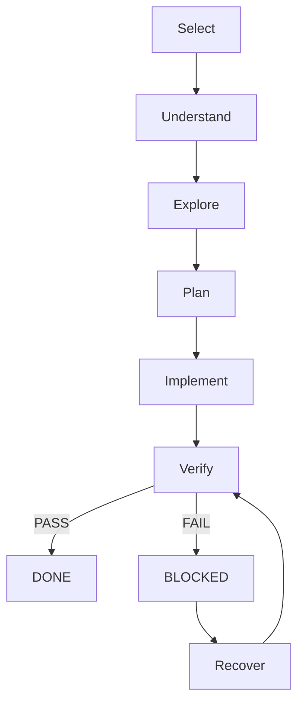

import { Card, CardGrid } from '@astrojs/starlight/components';

## The Problem

Most AI-assisted automation follows a "Hope-Driven" workflow:

**Generic AI Workflow**
Prompt → Code → **Hope**

**SPP Workflow**
Task → Protocol → Verification → **Done**

SPP replaces hope with a structured, file-backed protocol that ensures every change is verified against business requirements before it's considered complete.

## The Protocol

SPP uses a disciplined lifecycle to ensure quality and repeatability.

## Core Principles

<CardGrid stagger>
	<Card title="Verification First" icon="approve-check">
		Every task must pass automated quality gates and tests before it is considered DONE.
	</Card>
	<Card title="Markdown Tasks" icon="document">
		Work is tracked in human-readable, AI-friendly Markdown files stored directly in your repo.
	</Card>
	<Card title="Quality Gates" icon="setting">
		Automated checks enforce best practices like ARIA-first selectors and Page Object patterns.
	</Card>
	<Card title="Human + AI Collaboration" icon="pencil">
		Explicit handoffs and repair prompts keep the collaboration loop tight and productive.
	</Card>
	<Card title="Simple Architecture" icon="rocket">
		No complex databases or multi-agent systems. Just files, a CLI, and Playwright.
	</Card>
</CardGrid>
